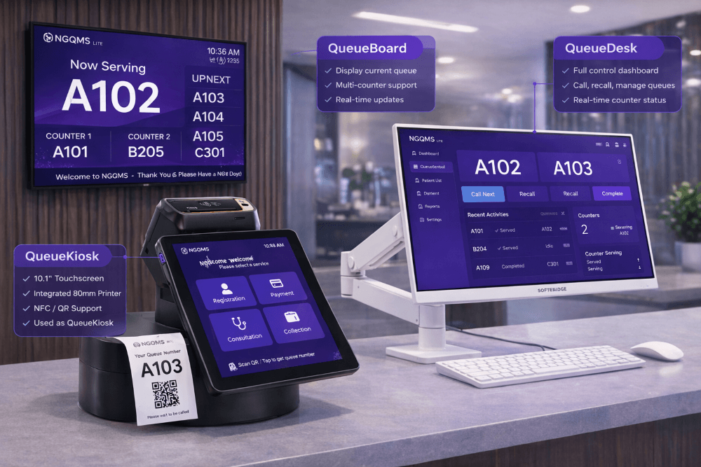

<section class="ngqms-hero">
  

    
Home › Products › NGQMS

    NGQMS — Smart Queue Management System

    <h1>End-to-end queue management made simple.</h1>

    

      NGQMS streamlines the entire customer journey — from ticketing to service —
      with real-time visibility, smart routing, and powerful analytics.
    

    <ul class="hero-list">
      <li>Reduce waiting time</li>
      <li>Improve service efficiency</li>
      <li>Enhance customer experience</li>
      <li>Data-driven decision making</li>
    </ul>

    

      <a class="btn-primary" href="mailto:enquiry@softbridge.com.my?subject=NGQMS Demo Request">Request Demo →</a>
      <a class="btn-secondary" href="#how-it-works">Watch Overview ▷</a>
    

  

  

    
  

</section>

<section class="section">
  

    <h2>The NGQMS Platform</h2>
    
A complete suite of tools to manage queues efficiently.

  

  

    <article class="product-card">
      
▣

      <h3>QueueDesk</h3>
      
Staff interface to manage queues and serve customers.

      
    </article>

    <article class="product-card">
      
▣

      <h3>QueueBoard</h3>
      
Live display to keep customers informed.

      
    </article>

    <article class="product-card">
      
◔

      <h3>QueueHub</h3>
      
Central dashboard for monitoring and analytics.

      
    </article>
  

</section>

<section id="how-it-works" class="section soft-section">
  

    <h2>How It Works</h2>
    
A simple 4-step process for a smoother service experience.

  

  

    

      1
      
▣

      <h3>Take a Ticket</h3>
      
Customers take a ticket from the kiosk.

    

    
→

    

      2
      
👥

      <h3>Wait Comfortably</h3>
      
Live updates keep customers informed.

    

    
→

    

      3
      
🔊

      <h3>Get Called</h3>
      
System calls the next ticket automatically.

    

    
→

    

      4
      
✓

      <h3>Get Served</h3>
      
Staff serves the customer efficiently.

    

  

</section>

<section class="section">
  

    <h2>Why Choose NGQMS</h2>
    
Built to deliver better outcomes for your organization and customers.

  

  

    

      
◷

      <h3>Real-time Visibility</h3>
      
Monitor all counters and queues in real time.

    

    

      
👥

      <h3>Multi-counter Support</h3>
      
Support multiple counters, services and priority queues.

    

    

      
▥

      <h3>Powerful Analytics</h3>
      
Make data-driven decisions with intelligent reports.

    

    

      
☁

      <h3>Cloud Ready</h3>
      
Secure, reliable and accessible anytime, anywhere.

    

    

      
◇

      <h3>Secure & Reliable</h3>
      
Designed for dependable operation and enterprise use.

    

  

</section>

<section class="industry-section">
  <h2>Designed for Every Industry</h2>

  

    ✚ Healthcare
    ▥ Government
    🏛 Banks
    ⌁ Telecommunications
    🎓 Education
    🛒 Retail
    ▦ More
  

</section>

<section class="final-cta">
  

    <h2>Ready to transform your service experience?</h2>
    
Let’s build smarter queues and happier customers together.

  

  <a href="mailto:enquiry@softbridge.com.my?subject=NGQMS Demo Request">Request Demo →</a>
</section>

