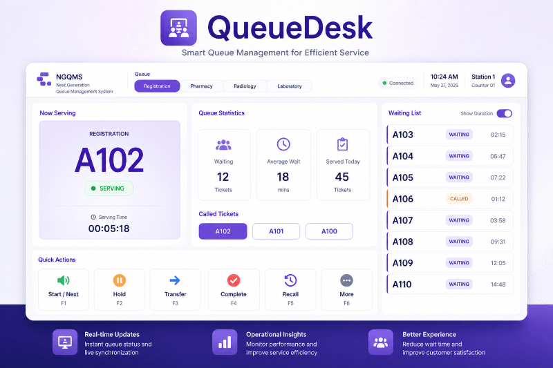

<section class="py-5">
  

    

      <!-- LEFT -->
      

        NGQMS PLATFORM

        <h1 class="fw-bold display-5 mt-2 mb-3">
          End-to-end queue management made simple.
        </h1>

        

          NGQMS streamlines the entire customer journey — from ticketing to service —
          with real-time visibility and smart automation.
        

        <ul class="list-unstyled mb-4">
          <li>✔ Reduce waiting time</li>
          <li>✔ Improve service efficiency</li>
          <li>✔ Enhance customer experience</li>
          <li>✔ Data-driven decision making</li>
        </ul>

        

          <a href="/contact" class="btn btn-primary btn-lg">
            Request Demo
          </a>
          <a href="#how-it-works" class="btn btn-outline-secondary btn-lg">
            How It Works
          </a>
        

      

      <!-- RIGHT -->
      

        
      

    

  

</section>

<!-- PLATFORM -->
<section class="py-5 bg-light">
  

    <h2 class="fw-bold mb-2">The NGQMS Platform</h2>
    

      Everything you need to manage queues from end to end.
    

    

      

        

          

            <h5 class="fw-bold">QueueDesk</h5>
            

              Staff interface to manage queues and serve customers.
            

            
          

        

      

      

        

          

            <h5 class="fw-bold">QueueBoard</h5>
            

              Live display to keep customers informed.
            

            
          

        

      

      

        

          

            <h5 class="fw-bold">QueueHub</h5>
            

              Central dashboard for monitoring and analytics.
            

            
          

        

      

    

  

</section>

<!-- HOW IT WORKS -->
<section id="how-it-works" class="py-5">
  

    <h2 class="fw-bold mb-2">How It Works</h2>
    
Simple flow for better service experience.

    

      

        <h5 class="fw-bold">1. Take Ticket</h5>
        
Customer gets queue number

      

      
→

      

        <h5 class="fw-bold">2. Wait</h5>
        
Real-time updates shown

      

      
→

      

        <h5 class="fw-bold">3. Called</h5>
        
Staff calls next queue

      

      
→

      

        <h5 class="fw-bold">4. Served</h5>
        
Customer gets service

      

    

  

</section>

<!-- WHY -->
<section class="py-5 bg-light">
  

    <h2 class="fw-bold mb-4">Why Choose NGQMS</h2>

    

      

        <h5 class="fw-bold">Real-time Visibility</h5>
        
Monitor queues instantly

      

      

        <h5 class="fw-bold">Multi-counter Support</h5>
        
Handle multiple service points

      

      

        <h5 class="fw-bold">Cloud Ready</h5>
        
Secure & accessible anywhere

      

    

  

</section>

<!-- CTA -->
<section class="py-5">
  

    <h2 class="fw-bold mb-3">
      Ready to transform your queue experience?
    </h2>

    

      Start managing queues the smart way.
    

    <a href="/contact" class="btn btn-primary btn-lg">
      Request Demo
    </a>

  

</section>
