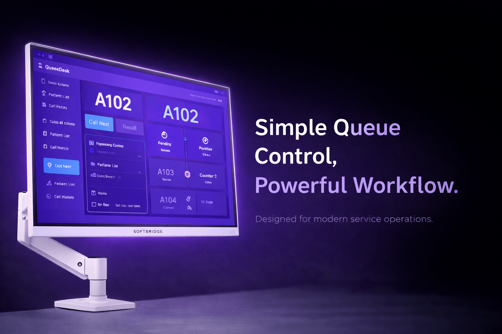

  

# NGQMS – Smart Queue, Smarter Experience  

### 🚀 Why Queue Management Matters

Customers don’t just wait — they **experience the wait**.

Industry benchmarks indicate:
- Up to **30–40% reduction in perceived waiting time**  
- **20–30% improvement in staff productivity**  
- Over **70% of customers prefer structured digital queue systems**  

> References: McKinsey & Company, PwC, Nielsen

### 🧠 Overview

NGQMS Lite is a cloud-based queue management solution designed to streamline customer flow in clinics and service environments.

**Key advantages:**
- Eliminates manual queue handling  
- Improves operational efficiency  
- Enhances customer experience  
- Ready within minutes  

### 💡 Key Benefits

- Reduced waiting confusion  
- Improved operational efficiency  
- Better customer experience  
- Enhanced professional image  
- Scalable and future-ready  

### 🏢 Suitable For

NGQMS is suitable for a wide range of industries:

- Healthcare (clinics, medical centers)  
- Service counters  
- Financial institutions  
- Repair and service centers  

Anywhere customers wait — NGQMS delivers value.

### 🎯 Final Thought

Customers may forget how long they waited,  
but they will always remember **how it felt**.

NGQMS ensures that every interaction feels **smooth, fair, and professional**.

### Get Started with NGQMS
👉 [Explore Platform Details →](./platform.md)  
👉 [View Pricing →](./pricing.md)

---

### 📞 Contact

**SOFTBRIDGE Enterprise**  
🌐 https://www.softbridge.com.my  

---
