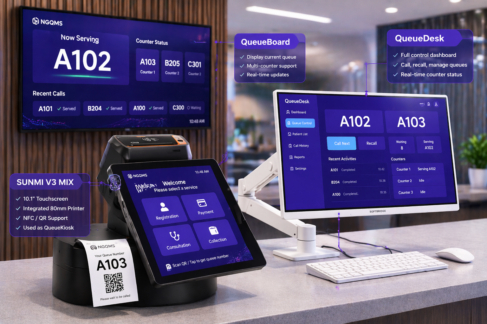

### 🧩 System Components

  

<em>Complete NGQMS Lite setup in a real service environment</em>

**🖥️ QueueBoard (Display)**
- 10–14 inch wall-mounted Android display  
- Built-in speaker for audio announcements  
- Displays current queue number and service location  

**🧾 QueueKiosk (Ticket Issuing Device)**
- SUNMI V3 Mix device  
- Integrated thermal printer  
- Optional QR-based ticketing  

**💻 QueueDesk (Staff Panel)**
- Runs on existing computers or laptops  
- Provides simple and intuitive controls:
  - Call next  
  - Recall  
  - Mark no-show  

### 🔄 System Workflow

| Step | What Happens | System Component | What the User Sees | Business Impact |
|------|--------------|------------------|--------------------|-----------------|
| 1 | Customer registers at counter | QueueKiosk | Queue number assigned | Organized intake, no manual tracking |
| 2 | Ticket is issued instantly | QueueKiosk | Printed or QR ticket | Faster registration, reduced waiting confusion |
| 3 | Staff calls next customer | QueueDesk | “Next” action triggered | Controlled and consistent queue flow |
| 4 | Display updates in real-time | QueueBoard | Current number shown clearly | Eliminates missed calls and confusion |
| 5 | Audio announcement is played | QueueBoard | Voice notification | Improves accessibility and awareness |
| 6 | Customer proceeds to service point | — | Clear direction | Faster service turnaround |

> This structured workflow ensures that every customer interaction is predictable, efficient, and professionally managed.

### 🆚 Traditional QMS vs NGQMS

| Area                 | Traditional QMS                          | NGQMS (SOFTBRIDGE)                        |
|----------------------|------------------------------------------|-------------------------------------------|
| Deployment Model     | Hardware-centric, on-premise setup       | Cloud-based, minimal setup                |
| Flexibility          | Fixed configuration                      | Modular and scalable                      |
| Queue Visibility     | Limited or static display                | Real-time, synchronized across devices    |
| Workflow Capability  | Single-stage queue                       | Multi-stage service orchestration         |
| Integration          | Standalone system                        | API-ready for HIS / ERP integration       |
| Scalability          | Requires hardware expansion              | Expandable via software and add-ons       |
| Maintenance          | Manual updates and support               | Centralized updates (cloud-managed)       |
| User Experience      | Basic and operator-dependent             | Structured, consistent, user-friendly     |
| Upgrade Path         | System replacement required              | Seamless upgrade (Lite → Enterprise)      |

> NGQMS is not just a queue system — it is a **queue orchestration platform**.

### 📦 Solution Packages

**Package Comparison**

| Feature         | Lite Basic       | Lite Pro           | Enterprise              |
|-----------------|------------------|--------------------|-------------------------|
| Target Use      | Small setup      | Growing operations | Large organizations     |
| Queue Handling  | Single queue     | Multi-queue*       | Multi-stage workflow    |
| Devices         | Standard setup   | Expandable*        | Enterprise-wide         |
| Reporting       | Basic summary    | Enhanced visibility| Advanced analytics      |
| Integration     | Not available    | Limited            | Full API / HIS          |
| Deployment      | Cloud            | Cloud              | Cloud / Hybrid          |

> * Expandable via add-on packages  

**Lite Basic**

Designed for small clinics or single-counter environments, Lite Basic provides essential queue functionality with minimal setup.

**Lite Pro**

Lite Pro supports multi-station operations and higher service volume, making it suitable for growing clinics or service centers.

**Enterprise**

Enterprise is a full-scale queue orchestration platform that supports integration with Hospital Information Systems (HIS), ERP systems, and enterprise applications.

This flexible architecture ensures NGQMS grows with your business.

👉 [View Pricing Plans →](./pricing.md)

### Scalability

NGQMS is built with a modular architecture, allowing organizations to scale from Lite Basic to Enterprise without replacing the system.

> Start small. Scale as you grow.

### ☁️ Cloud-Based Platform

- No on-premise server required  
- Secure internet-based access  
- Automatic updates and maintenance  
- Scalable infrastructure  

← [Back to Overview](./index.md)
